The adress download:
https://www.proxmox.com/en/downloads

For more detail and information use https://pve.proxmox.com/pve-docs/ . 

https://pve.proxmox.com/pve-docs/pve-admin-guide.html
https://pve.proxmox.com/pve-docs/pve-admin-guide.pdf

Proxmox binary comes in form of ***.iso*** file; it would be a better Ideo to use a USB and a USB_Imager z.b. Rufus to achieve a faster Installation. 

At the beginning we get a screen of choices; just select " install proxmox VE" 

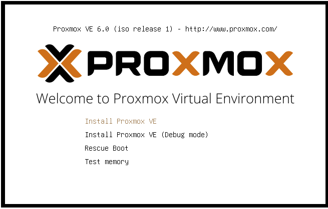

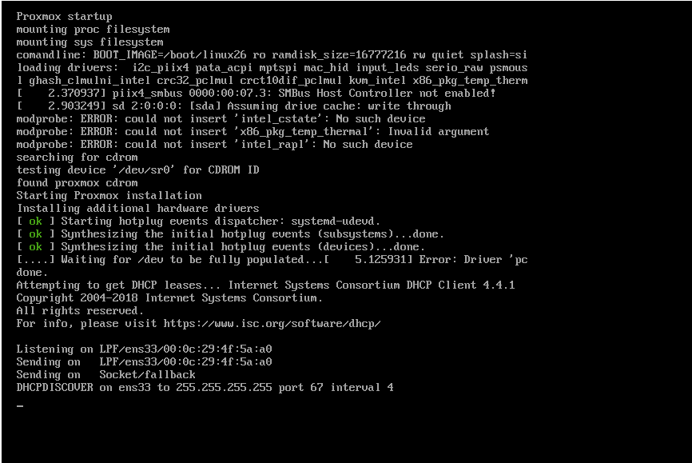

We proceed by reading the contract and saying “I agree” on the screen that comes up.
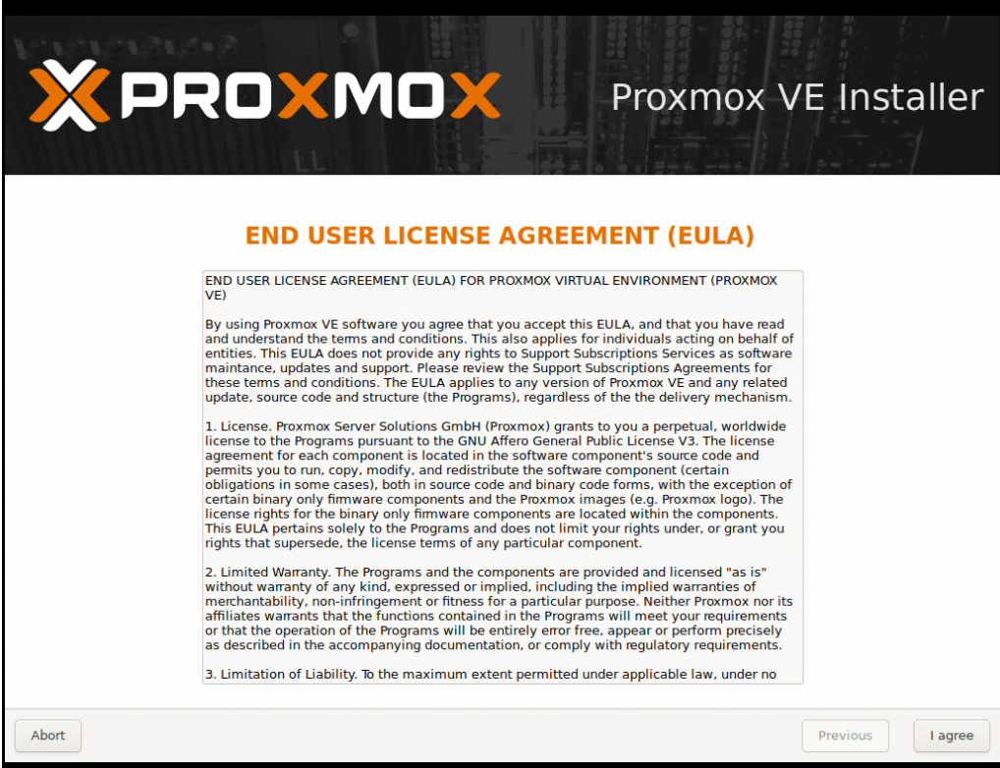

On the screen that opens, it shows what we can do on the disk side that we have reserved for the system.
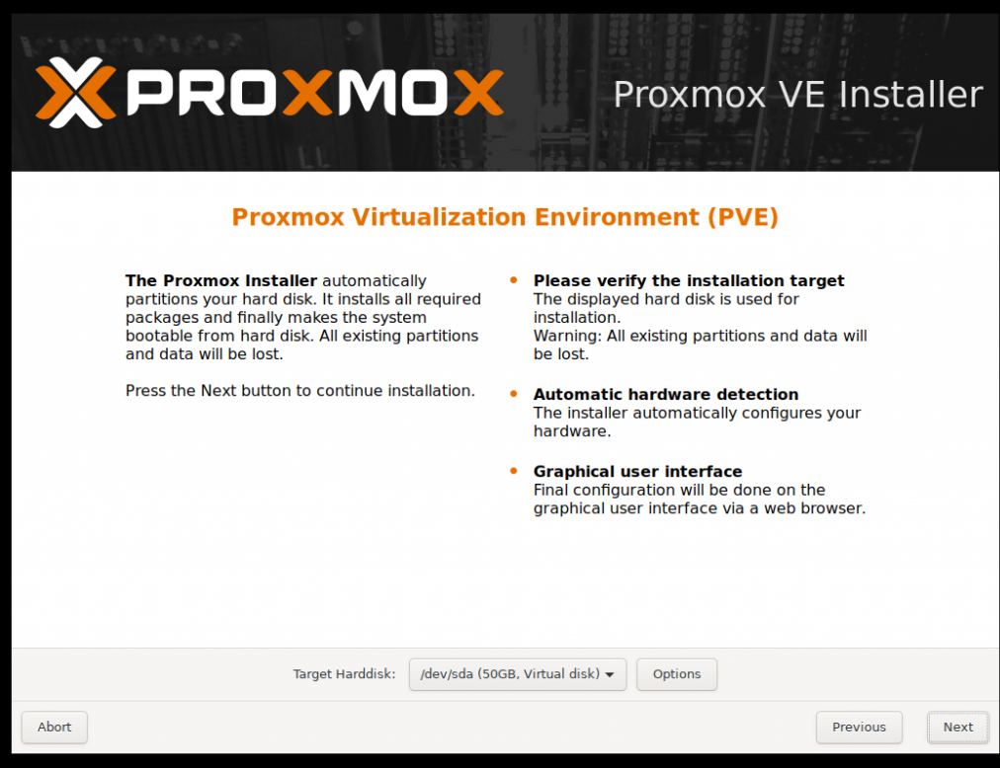

If you wish, you can configure your own file format-specific raid via Proxmox. Since there is a Raid Structure on the servers used by many System Administrators, we can switch to the next screen by saying "Next" without doing anything in this section.
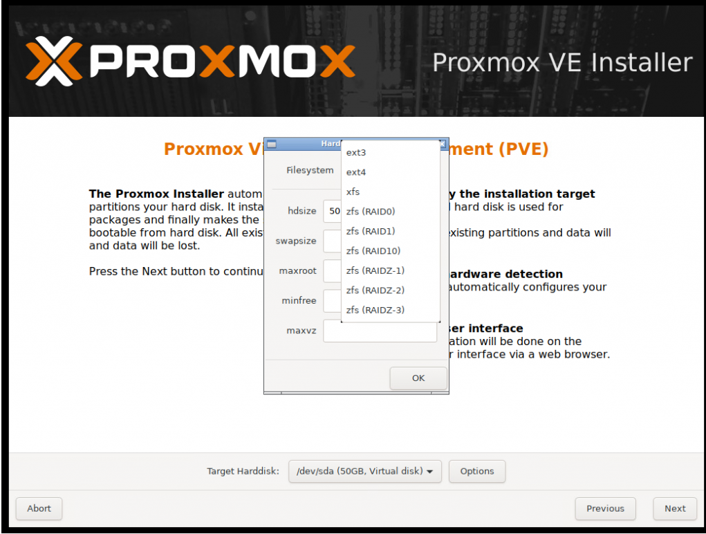

On the screen that opens,  set the Country, Time and Keyboard Layout and continue.
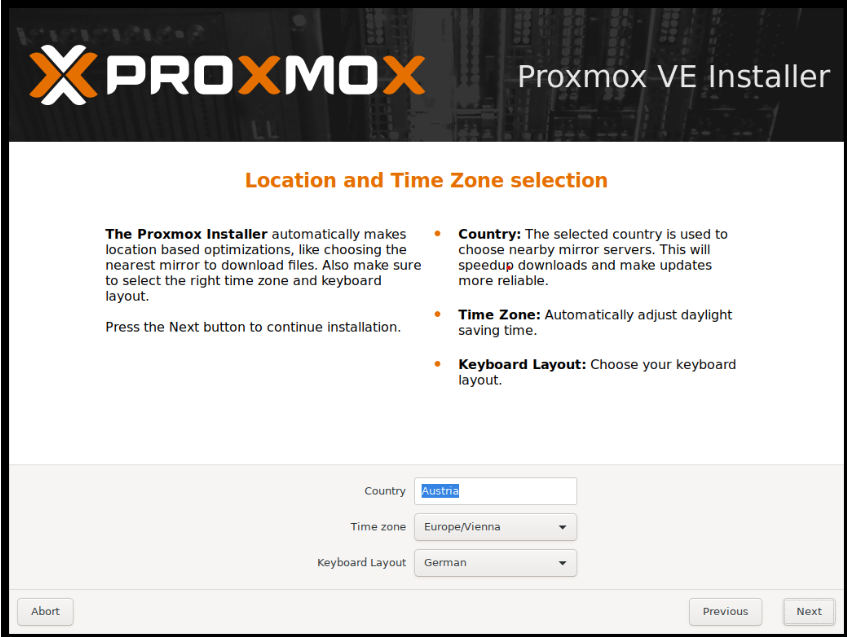

On the screen that comes up, we set the administrator password and e-mail address and continue by saying "Next".
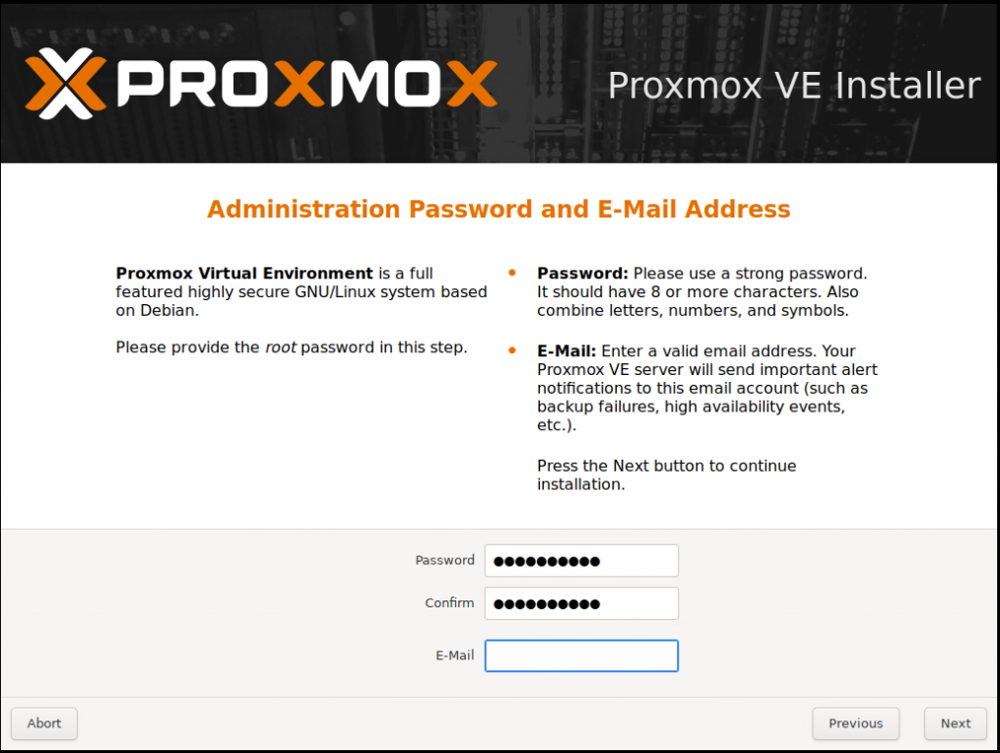

The screen that opens contains the Hostname (FQDN) and IP address information. We can edit it according to our own structure. 
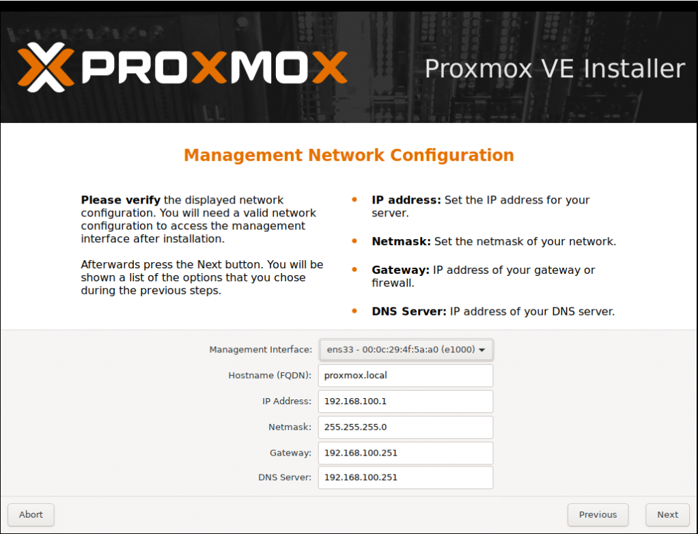

Our summary screen has arrived. If the information on this screen is correct, start the installation by saying "install".
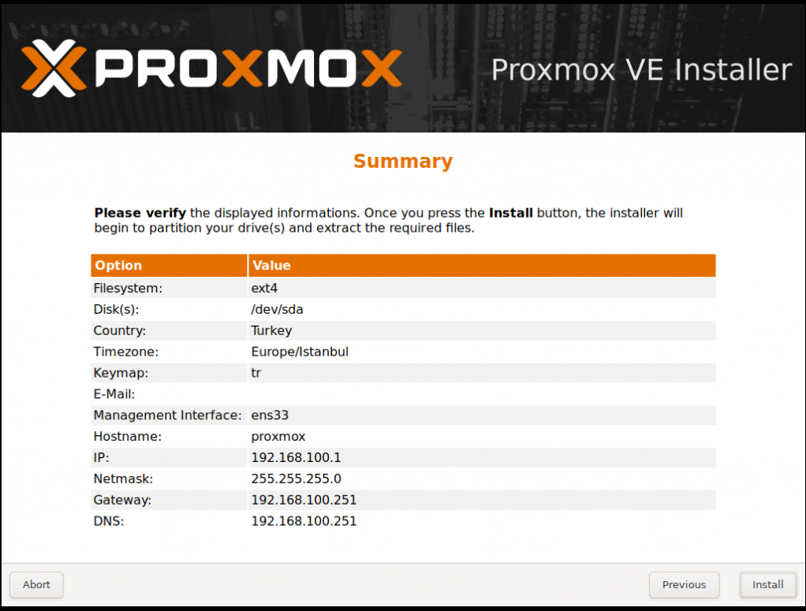

Installation will take some time.
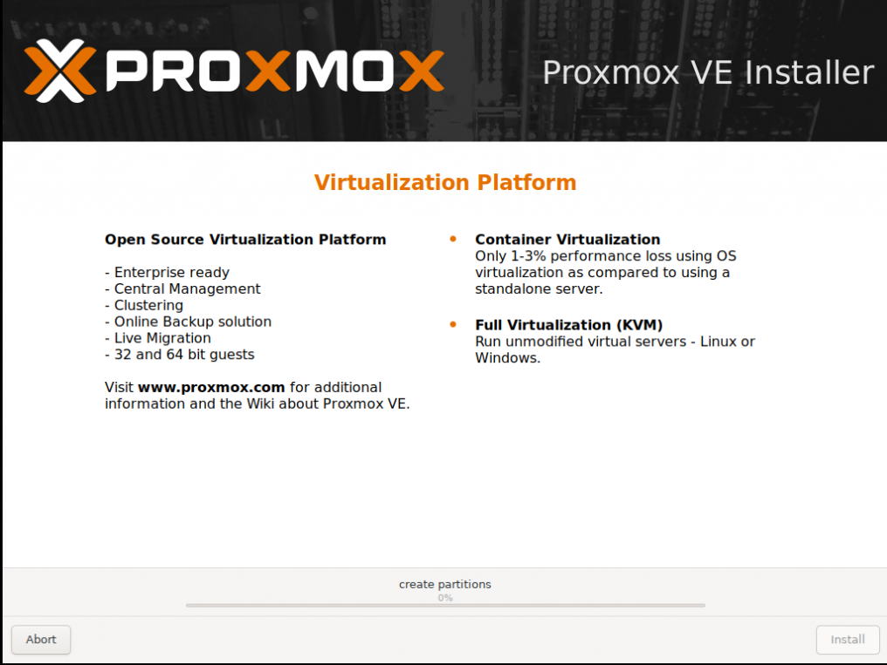

Wenn the installation is succesfully finished, reboot the system. 
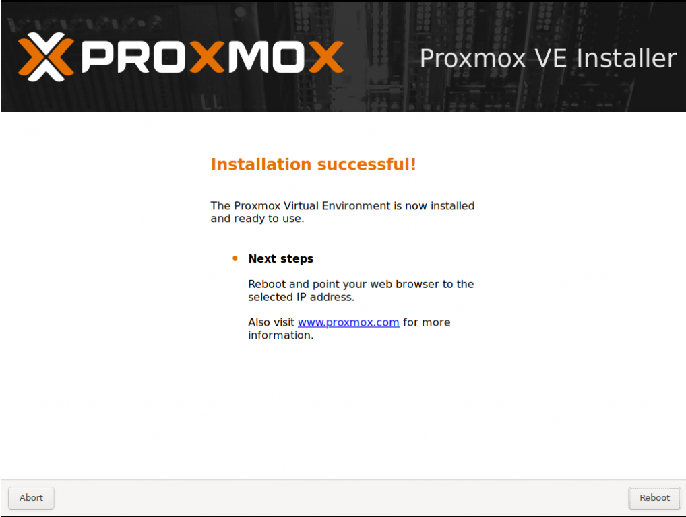

Our device has restarted and you can access its interface via https://ipadresinde:8006/.
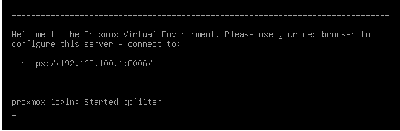

The device interface can be accessed via the IP Address. On the screen that opens, I enter the password that we specified during the installation. Username: root If the password is the login, I log in by saying "Login".

The Proxmox Interface has arrived and the installation has been completed.

