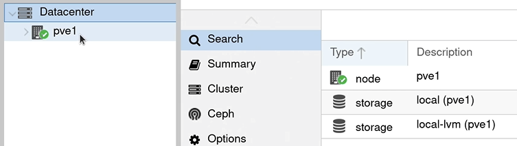

User-Interface of Proxmox is a web-Consol
To go in type: "IP_Adress:8086 " 

We see a tree structure and at the very top links there is "Datacenter" as root. That is aour entire rechnencenter. 

to change on additional overview oprions :

Hier is the actual server:

