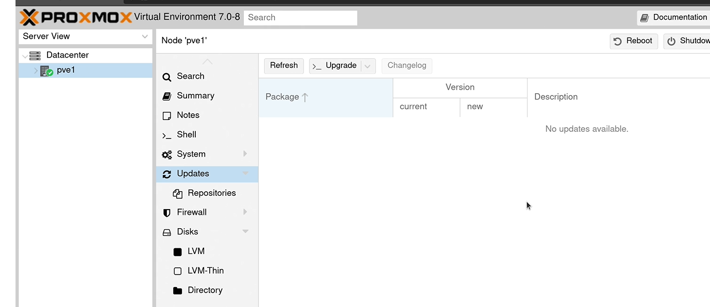

User-Interface of Proxmox is a web-Consol
To go in type: "IP_Adress:8086 " 

We see a tree structure and at the very top links there is "Datacenter" as root. That is aour entire rechnencenter. 

Hier is the actual server:

to change on additional overview oprions :

In Summary tag, We can see additional features and metrick of the rechnen-center. As long as we install VM s and Containers, will we see the emtrics of other machines. 

in Notes section we can feed some infos. Thats may be useful. 

With shell we can command das system over CLI. 

Under the system section we can configure and manage Network of the system. We can make additional bridges , new NIC s. 
certificates 

if we have a custom dns server in
our network, we should make sure that
the ip address for that matches right
here.

wW have access
to the host file for the server
so if there's any static host entries
that you want to add here you can
definitely do that
now i actually recommend  avoid this
if you can because it's better to use
dns for hostname lookups, anyway
so if you have access to a dns server i
recommend you add any entries there
because that makes those particular
entries available anywhere on your
network.
but if you do have a reason to update
the  /etc/host file you can do that here

Time is critical, if the time is not sincrinisiert with teh system, any strange things can happen. 

In syslog we can determine the porcesses, any error messages can be processed. 

If there ist anything to update we can find its as note in update section. By clicking the refresh button we can list the updates, such as "apt update " command, and by clicking tne Upgrade button we can update and upgrade, such as "apt upgrade" command. 

