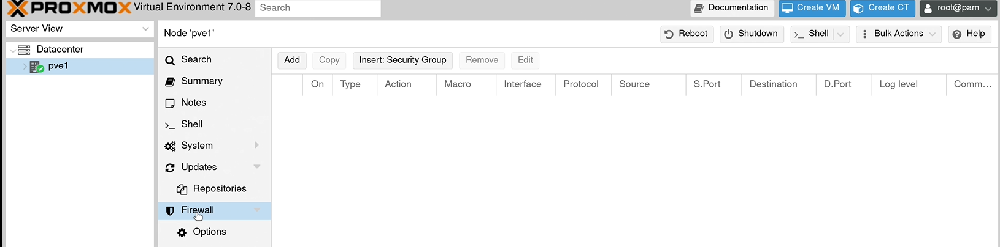

User-Interface of Proxmox is a web-Consol
To go in type: "IP_Adress:8086 " 

We see a tree structure and at the very top links there is "Datacenter" as root. That is aour entire rechnencenter. 

Hier is the actual server:

to change on additional overview oprions :

#Summary
In Summary tag, We can see additional features and metrick of the rechnen-center. As long as we install VM s and Containers, will we see the emtrics of other machines. 

#Notes
in Notes section we can feed some infos. Thats may be useful. 

#Shell
With shell we can command das system over CLI. 

#System
Under the system section we can configure and manage Network of the system. 
##NetworkWe can make additional bridges , new NIC s. 
certificates 

##DNS
if we have a custom dns server in
our network, we should make sure that
the ip address for that matches right
here.

##Hosts
wW have access
to the host file for the server
so if there's any static host entries
that you want to add here you can
definitely do that
now i actually recommend  avoid this
if you can because it's better to use
dns for hostname lookups, anyway
so if you have access to a dns server i
recommend you add any entries there
because that makes those particular
entries available anywhere on your
network.
but if you do have a reason to update
the  /etc/host file you can do that here

##Time
Time is critical, if the time is not sincrinisiert with teh system, any strange things can happen. 

##Syslog
In syslog we can determine the porcesses, any error messages can be processed. 

#Update
If there ist anything to update we can find its as note in update section. By clicking the refresh button we can list the updates, such as "apt update " command, and by clicking tne Upgrade button we can update and upgrade, such as "apt upgrade" command. 

After we clik on refresh we got a list of programs to update .

Then we clisk on "upgrade" and get consoe to ise for updating&&upgradeing. When we tyep the process, in the whole server will the updates iwill be installed. . 

When the process of updating made, we can check by refresh command. 

After we installed updates, we must reboot the system. 

###Repositories
If I want to add another repository hier by clicking over "add" button, we can add new repositpriess includingtest repositories. 

#Firewall
There is a firewall inside proxmox. We cann use that to allow or disallow traffic.

#Storage/Disks
We can get a list of all stroages under our server.

Between individual partiitons, we see LVM .Actually its correpands with Blackmarked LWM under Disk Section. Wenn we clik on that we would see, its fas fully used and alarming . It desn t mean that, there is nod space on LVm, it actuially means, that fst all disk used as LVM. 

The actual data useage w will see under LVM-Thin

We have "Directory " and "ZFS" . ZFS is suitable for big Data Storages. 

#Task History

#Subscription

#Blue Buttons
This two buttons are very imortant 
one to install VM's
one to make Containers
